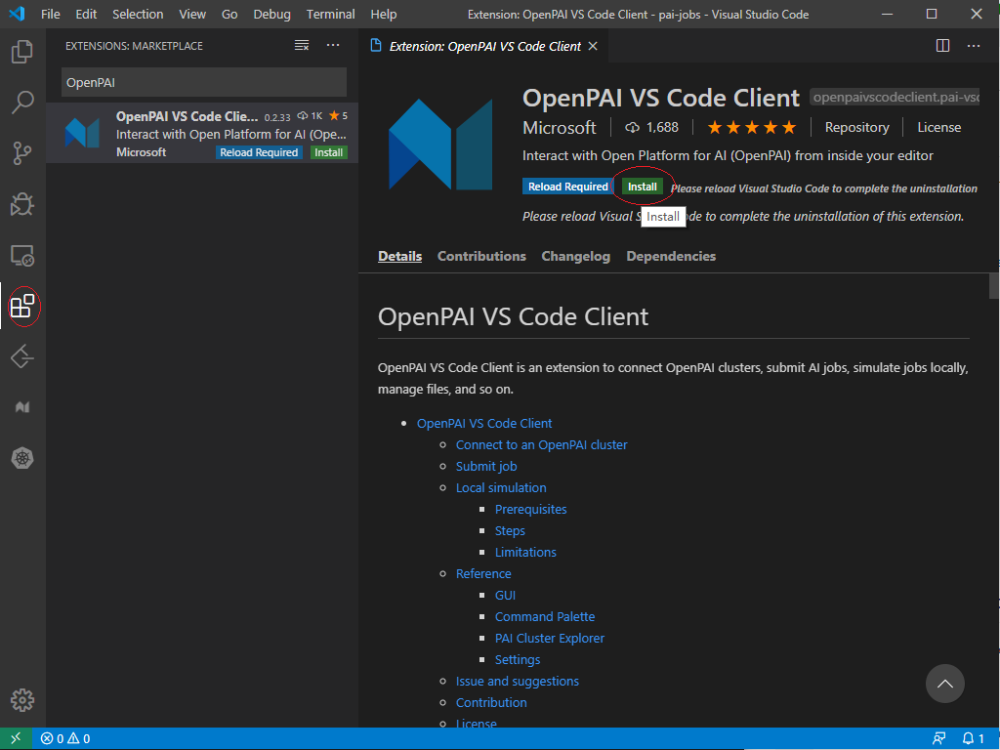
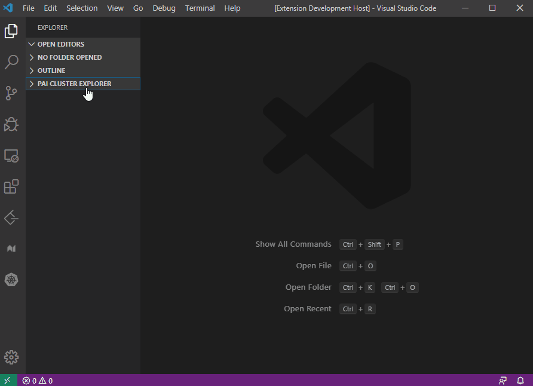
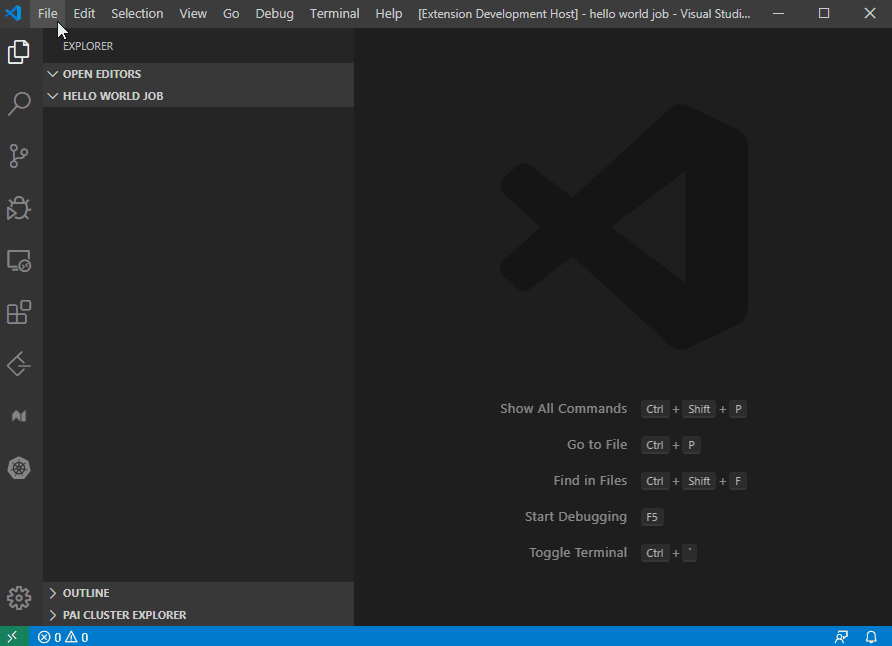
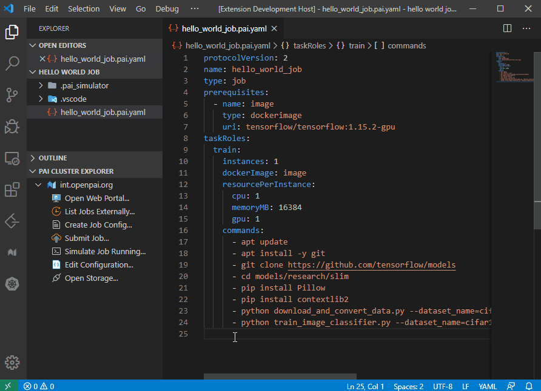
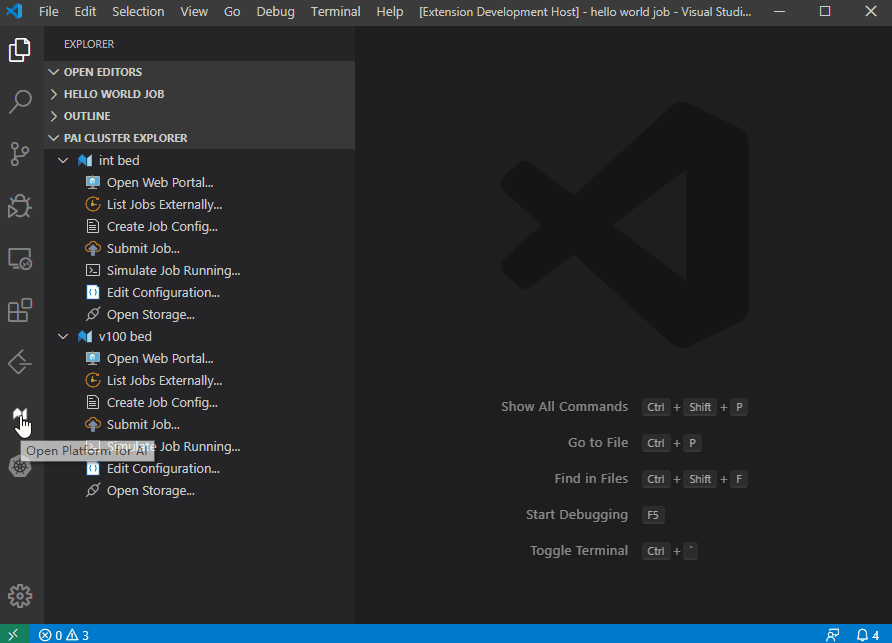
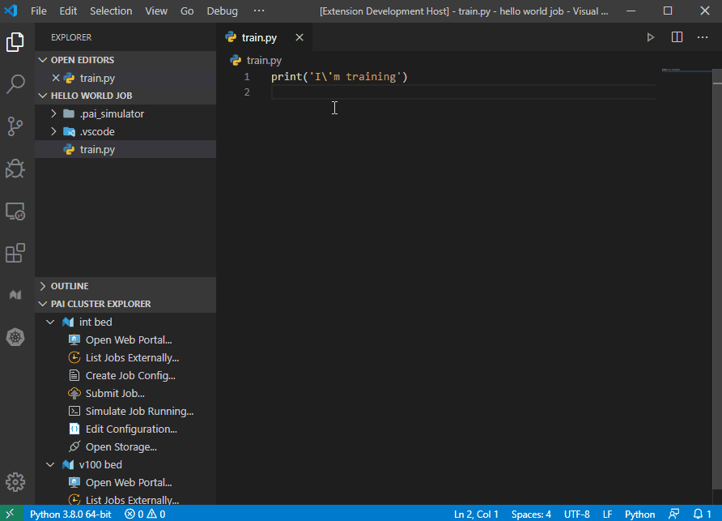

# Submit job to OpenPAI by VSCode Extension

This document is a tutorial for OpenPAI job submission on VSCode Extension.
Before learning this document, make sure you have an OpenPAI cluster already, and already install VSCode.

- [Submit job to OpenPAI by VSCode Extension](#submit-job-to-openpai-by-vscode-extension)
  - [Install OpenPAI VSCode Client](#install-openpai-vscode-client)
  - [Connect to OpenPAI Cluster](#connect-to-openpai-cluster)
  - [Submit a Hello World Job](#submit-a-hello-world-job)
    - [Create a job config file](#create-a-job-config-file)
    - [Edit the config file](#edit-the-config-file)
    - [Submit it](#submit-it)
  - [Manage Your Data](#manage-your-data)
    - [Teamwise Storage](#teamwise-storage)
    - [Storage explorer](#storage-explorer)
    - [Source code auto upload](#source-code-auto-upload)
  - [Reference](#reference)

## Install OpenPAI VSCode Client

In VSCode Extension Marketplace search [OpenPAI VS Code Client](https://marketplace.visualstudio.com/items?itemName=OpenPAIVSCodeClient.pai-vscode), and click Install.



## Connect to OpenPAI Cluster

1. Click the '+' button in `PAI CLUSTER EXPLORER`, or press `Ctrl+Shift+P` to open command palette look for `"PAI: Add PAI Cluster"` command and select it.
2. Input input the host of an OpenPAI cluster. It can be domain name or IP Address. After that, press `Enter`.
3. A configuration file is opened, you can config it. Once it completes, click `Finish` button at right bottom corner. Notice, it won't be effect, if you save and close the file directly.
4. If there are multiple OpenPAI clusters, you can follow above steps again to connect with them.



## Submit a Hello World Job

The job of OpenPAI defines how to execute code(s) and command(s) in specified environment(s). A job can be run on single node or distributedly.
The following process submits a model training job implemented by TensorFlow on CIFAR-10 dataset. It downloads data and code from internet and helps getting started with OpenPAI.

### Create a job config file

1. Create a new folder name `'hello world job'` and open it in VSCode.
2. Double click the `Create Job Config...` button in `PAI CLUSTER EXPLORER`, the first time you click, it may ask you to config the `Auto Upload` and `Add job name suffix` feature, in this hello world job, we can select `No` for `Auto Upload` and `Yes` for `Add job name suffix`.
3. Save the job config file in your vscode workspace.



For other ways to create job config file, refer to [Create job config file](edit_yaml_job_config.md#Create-job-config-file).

### Edit the config file

Change the config file to this:

```yaml
protocolVersion: 2
name: hello_world_job
type: job
prerequisites:
  - name: image
    type: dockerimage
    uri: tensorflow/tensorflow:1.15.2-gpu
taskRoles:
  train:
    instances: 1
    dockerImage: image
    resourcePerInstance:
      cpu: 1
      memoryMB: 16384
      gpu: 1
    commands:
      - apt update
      - apt install -y git
      - git clone https://github.com/tensorflow/models
      - cd models/research/slim
      - pip install Pillow
      - pip install contextlib2
      - python download_and_convert_data.py --dataset_name=cifar10 --dataset_dir=/tmp/data
      - python train_image_classifier.py --dataset_name=cifar10 --dataset_dir=/tmp/data --max_number_of_steps=1000
```

The `OpenPAI VS Code Client` support some features to improve user experience for editing job config file, please refer to [OpenPAI job config file edit features](edit_yaml_job_config.md).
To learn more about this job, please refer to [Learn the Hello World Job](https://github.com/microsoft/pai/blob/master/docs/user/job_submission.md#Learn-the-Hello-World-Job)

### Submit it

Finish editing the config file, save it and right click on the editor and select `Submit Job to PAI Cluster`.
After the information `Successfully submitted job.` pop up, you can click the `Open job page` button at right bottom corner, and view you job on website.



## Manage Your Data

Most model training and other kinds of jobs need to transfer files between running environments and outside. Files include dataset, code, scripts, trained model, and so on.

### Teamwise Storage

OpenPAI admin can define Team-wise storage through [Storage Plugin](https://github.com/microsoft/pai/tree/master/contrib/storage_plugin).
User's job container can mount to the storage if user add it in job config file, for how to insert storage plugin into job config, please refer to [Insert OpenPAI Runtime Plugin](edit_yaml_job_config.md#Insert-OpenPAI-Runtime-Plugin).

### Storage explorer

To manage user's data in Team-wise storage, `OpenPAI VS Code Client` support a `STORAGE EXPLORER` in vscode, User can manage data in the explorer.
We also support an `Auto Upload` feature in VSCode, the client will auto upload user's project file to the storage before submit job.
For more detail, refer to [Storage Explorer and Auto Upload](storage_explorer_and_auto_upload.md)



### Source code auto upload

VSCode is a very powerful editor, user can use it to edit their source code, the auto upload feature make the source code to PAI job easily.
For more detail, refer to [Storage Explorer and Auto Upload](storage_explorer_and_auto_upload.md#Auto-Upload)



## Reference

[PAI Job Protocol](https://github.com/microsoft/openpai-protocol/blob/master/schemas/v2/schema.yaml)
[Submit Jobs on OpenPAI](https://github.com/microsoft/pai/blob/master/docs/user/job_submission.md#job-workflow)
[Troubleshoot jobs](https://github.com/microsoft/pai/blob/master/docs/user/troubleshooting_job.md)
