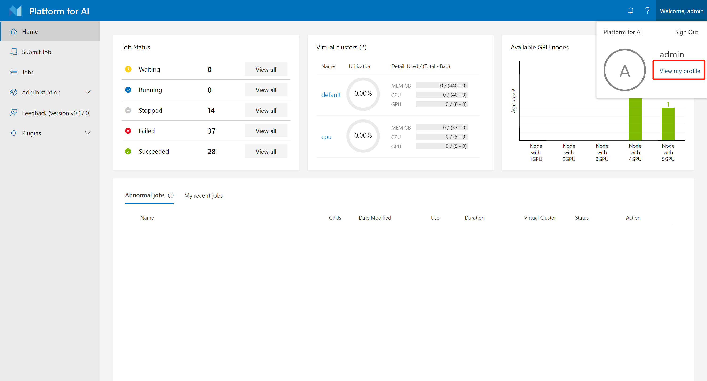

# How to Manage Data

## Get Permitted Storage

You should first have at least one permitted storage to manage data in OpenPAI. To view your permitted storage, first, go to your profile page:



Then all storages you have access to will be displayed:


If the display list is empty, please contact the cluster administrator.

## Upload data

There are multiple types of storage. We will introduce how to upload data to `NFS`, `AzureBlob`, and `AzureFile` storage as examples.

### Upload data to NFS

#### Upload data to NFS server on Ubuntu (16.04 or above)

For Ubuntu users. To upload data to an `NFS` storage, please run the following commands first to install NFS dependencies.

```bash
sudo apt-get update
sudo apt-get install --assume-yes nfs-common
```

Then you can mount NFS into your machine:
```bash
sudo mkdir -p MOUNT_PATH
sudo mount -t nfs4 NFS_SERVER:/NFS_PATH MOUNT_PATH
```

Copy your data to the mount point will upload your data to `NFS`.

The `NFS_SERVER` and `NFS_PATH` can be found in the `Storage` section on your profile page.

#### Upload data to NFS server in Windows

You could access `NFS` data by `Windows File Explorer` directly if:

  - The cluster administrator setup `NFS` by `storage-manager`. `storage-manager` will provide a `samba` server. 
  - The cluster administrator configures a `samba` server along with the `NFS` server by himself.

To access it, use the file location `\\NFS_SERVER_ADDRESS` in `Window File Explorer`. It will prompt you to type in a username and a password:

  - If OpenPAI is in basic authentication mode (this mode means you use a basic username/password to log in to OpenPAI webportal), you can access NFS data through its configured username and password. Please note it is different from the one you use to log in to OpenPAI. If the administrator uses `storage-manager`, the default username/password for NFS is `smbuser` and `smbpwd`.

  - If OpenPAI is in AAD authentication mode, you can access NFS data through the user domain name and password.

If it doesn't work, please make sure the `network discovery` is on, or contact your administrator for help.

If you cannot use direct access, please try to mount NFS into Windows or using a Linux VM to upload data.

### Upload data to Azure Blob or Azure File

For Azure Blob, you can get the `storage account name` and `container name` on the profile page.

For Azure File, you can get the `storage account name` and `file share name` on the profile page.

To upload data to Azure Blob or Azure File, please:

1. Download and install [Azure Storage Explorer](https://azure.microsoft.com/en-us/features/storage-explorer/).
<<<<<<< HEAD
<<<<<<< HEAD
2. If you use AAD to login into the PAI portal, the administrator should already permit you to access storage. You can get the `storage account name`, `container name`, and `file share name` on the profile page. Please use them to access storage in `Azure Storage Explorer`. For more details, please refer to [storage explore: add resource via azure ad](https://docs.microsoft.com/en-us/azure/vs-azure-tools-storage-manage-with-storage-explorer?tabs=windows#add-a-resource-via-azure-ad).
3. If you use basic authentication (username/password) to login into the PAI portal, please ask your administrator for the storage `access key`. Then you can add the storage by `access key` and `storage account name`. For more details, please refer to [storage explore: use name and key](https://docs.microsoft.com/en-us/azure/vs-azure-tools-storage-manage-with-storage-explorer?tabs=windows#use-a-name-and-key).
=======
2. If you use AAD to login to PAI portal, the administrator should already grant you the permission to access storage. You can get the `storage account name`, `container name` and `file share name` on the profile page. Please use them to access storage in `Azure Storage Explorer`. For more details, please refer to [storage explore: add resource via azure ad](https://docs.microsoft.com/en-us/azure/vs-azure-tools-storage-manage-with-storage-explorer?tabs=windows#add-a-resource-via-azure-ad).
3. If you use basic authentication (username/password) to login to PAI portal, please ask your administrator for the storage `access key`. Then you can add the storage by `access key` and `storage account name`. For more details, please refer to: [storage explore: use name and key](https://docs.microsoft.com/en-us/azure/vs-azure-tools-storage-manage-with-storage-explorer?tabs=windows#use-a-name-and-key).
>>>>>>> a3ad2cbc... user docs modification
=======
2. If you use AAD to login into the PAI portal, the administrator should already permit you to access storage. You can get the `storage account name`, `container name`, and `file share name` on the profile page. Please use them to access storage in `Azure Storage Explorer`. For more details, please refer to [storage explore: add resource via azure ad](https://docs.microsoft.com/en-us/azure/vs-azure-tools-storage-manage-with-storage-explorer?tabs=windows#add-a-resource-via-azure-ad).
3. If you use basic authentication (username/password) to login into the PAI portal, please ask your administrator for the storage `access key`. Then you can add the storage by `access key` and `storage account name`. For more details, please refer to [storage explore: use name and key](https://docs.microsoft.com/en-us/azure/vs-azure-tools-storage-manage-with-storage-explorer?tabs=windows#use-a-name-and-key).
>>>>>>> 0f6d9eb4... refine English docs

## Use Storage in Jobs

### Use Data Section UI

You can select desired storage in the `Data` section on the job submission page:


As shown in the picture, corresponding storage will be mounted to `/mnt/confignfs` folder.

### Use Job Configuration File

You can also specify storage names in `extras.storages` section in the [job configuration file](./how-to-use-advanced-job-settings.md#job-protocol-export-and-import-jobs):

```yaml
extras:
    storages:
    - name: confignfs
      mountPath: /data
    - name: azure-file-storage
```

There are two fields for each storage, `name` and `mountPath`. `name` refers to storage name while `mountPath` is the mount path inside job container. `mountPath` has default value `/mnt/${name}` and is optional.

<<<<<<< HEAD
<<<<<<< HEAD
Set it to an empty list (as follows) will mount default storage for the current user in the job.
=======
Set it to an empty list (as follows) will mount default storage for current user in the job.
>>>>>>> a3ad2cbc... user docs modification
=======
Set it to an empty list (as follows) will mount default storage for the current user in the job.
>>>>>>> 0f6d9eb4... refine English docs

```yaml
extras:
    storages: []
```
