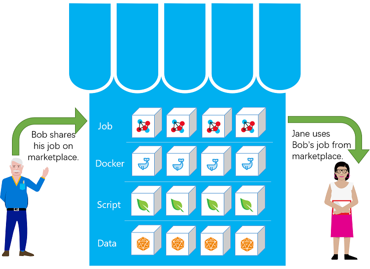
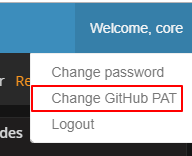
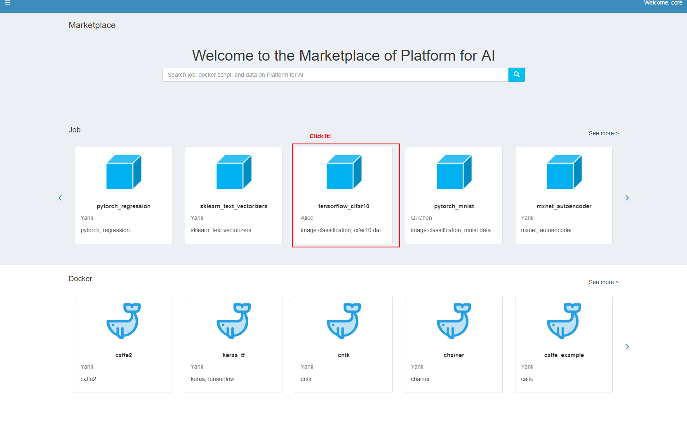
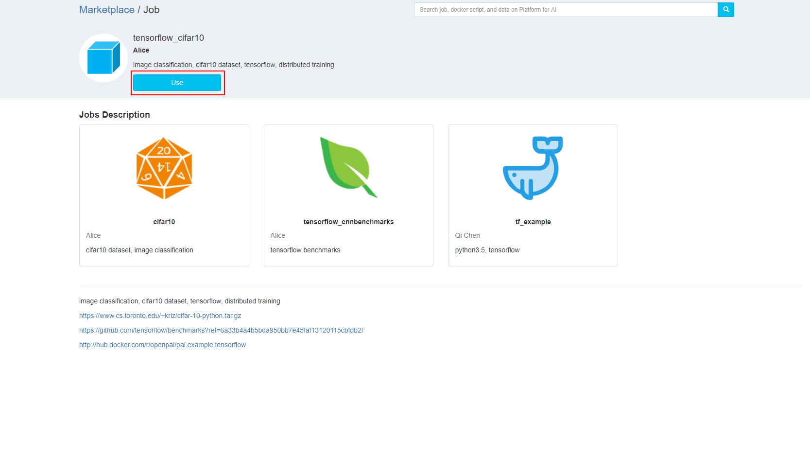
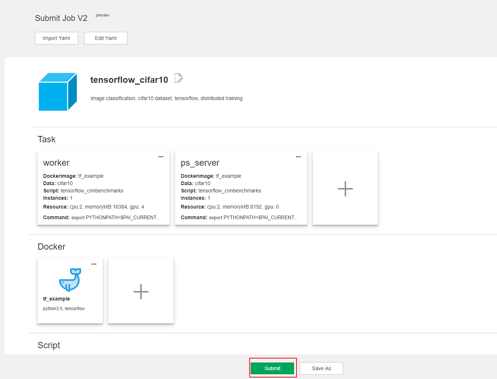
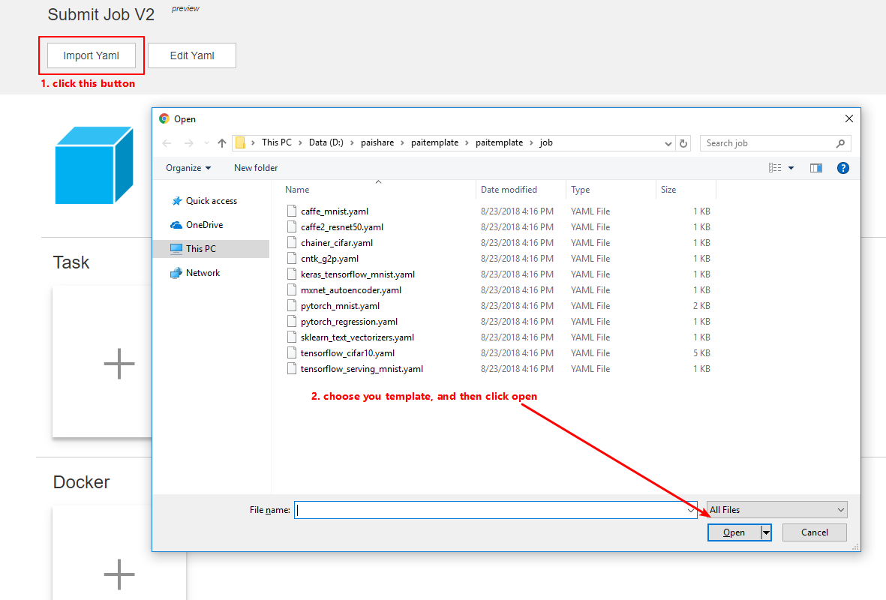
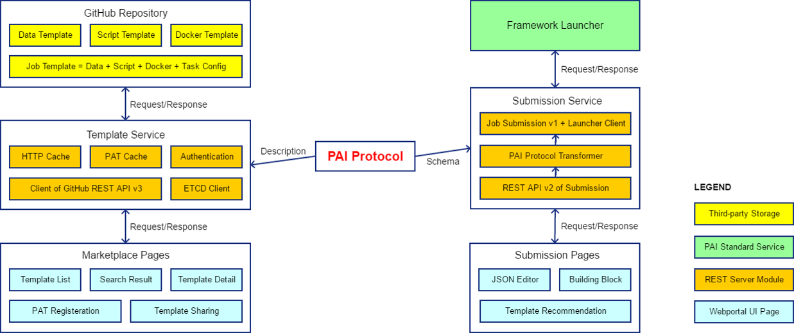

# Marketplace and Submit job v2

Marketplace and Submit job v2 are designed to reproducible AI. It helps to reuse machine learning asset across projects or teams: job template sharing and reuse for docker images, data, code, job configuration and etc.


## Table of Contents

1. [Marketplace and Submit job V2 Overview](#marketplace-and-submit-job-v2-overview)
2. [When to consider marketplace and submit job v2](#when-to-consider-marketplace-and-submit-job-v2)
3. [How to use](#how-to-use)
4. [System design](#system-design)
5. [Resource](#resource)


## Marketplace and Submit job V2 Overview
In fact, OpenPAI's job configuration can be composed by tasks, docker images, script and data.

When writing a job configuration, you can create new components(tasks, data, script and docker images) or use existing ones.


And you can share the script, data, docker images or whole job configuration on the marketplace, and other people can reuse it easily.




## When to consider marketplace and submit job v2

1. When you want to try different models on your collected/downloaded data.
2. When you want to use your model to train or predict on different data.
3. When you want to share your data, model, docker images, job template with others.
4. When you just want to try OpenPAI.


## How to use

### Configure GitHub PAT

1. At PAI home page, click the top right corner to **login**

2. Click your username at the top right corner, and then click "Change Github PAT"




3. Enter your github personal Access Token, and click update. If you don't know how to get it, click the "How to config Github PAT" to see details.


### Run a job from marketplace

1. At PAI home page, click the top right corner to **login** (Ignore this step if you are already logged in).
2. At the left sidebar, click "marketplace"


3. Then choose a job template, for example: tensorflow_cifar10



4. In job details page, click the "use" button, then it will go to the submit page(v2 version).

   

5. Click "Submit" button at the bottom, If you successfully submitted the job, you will see a success message.




### Introduction to yaml file

In submit job v2,  we use **yaml** to describe the job configuration. The detailed format is shown as below :
```yaml
protocol_version: String
name: String
type: job
version: String
contributor: String
description: String
retryCount: Integer
virtualCluster: String
gpuType: String

parameters:
  param1: valType1
  param2: valType2

tasks:
  - role: String
    data: String
    script: String
    dockerimage: String
    resource: 
      instances: Integer
      resourcePerInstance: 
        cpu: Integer
        memoryMB: Integer
        shmMB: Integer
        gpu: Integer
      portList:
        - label: String
          beginAt: Integer
          portNumber: Integer
    minFailedTaskCount: Integer
    minSucceededTaskCount: Integer
    parameters:
      taskParam1: taskValType1
      taskParam2: taskValType2
    command: 
      - String

prerequisites: 
  - protocol_version: String
    name: String
    type: String
    version: String
    contributor: String
    description: String
    uri: String
```

The detailed explanation for each of the parameters in each session of the config file is as follows:

> job
 
| Field Name                       | Schema                     | Description                              |
| :------------------------------- | :------------------------- | :--------------------------------------- |
| `protocol_version`               | String, optional           | Protocol version, If omitted, it will be **_v2_**|
| `name`                           | String, in `^[A-Za-z0-9\-._~]+$` format, required | Name of the job   |
| `type`                           | String, required           | Must be **_job_**                            |
| `version`                        | String, optional           | Version of the job template              |
| `contributor`                    | String, optional           | Contributor of the job template          |
| `description`                    | String, optional           | Description of the job template          |
| `virtualCluster`                 | String, optional           | The virtual cluster job runs on. If omitted, the job will run on **_default_** virtual cluster    |
| `retryCount`                     | Integer, optional          | Job retry count, no less than 0          |
| `gpuType`                        | String, optional           | Specify the GPU type to be used in the tasks. If omitted, the job will run on any gpu type |
| `parameters`                     | Object, optional           | Specify name and value of all the referencable parameters that will be used in the job template. They can be referenced by **_$$paramName$$_**.  |
| `prerequisites`                  | List, required             | List of `prerequisite`, specify docker image at least |
| `tasks`                          | List, required             | List of `taskRole`, one task role at least |

> prerequisite

| Field Name                       | Schema                     | Description                              |
| :------------------------------- | :------------------------- | :--------------------------------------- |
| `protocol_version`               | String, optional           | Protocol version, If omitted, it will be **_v2_**|
| `name`                           | String, in `^[A-Za-z0-9\-._~]+$` format, required | Name of the prerequisite |
| `type`                           | String, required           | Type of the prerequisite, must be **_data_**, **_script_**, or **_dockerimage_** |
| `version`                        | String, optional           | Version of the prerequisite              |
| `contributor`                    | String, optional           | Contributor of the prerequisite          |
| `description`                    | String, optional           | Description of the prerequisite          |
| `uri`                            | String, required           | Reference URL                            |


> taskRole

| Field Name                       | Schema                     | Description                              |
| :------------------------------- | :------------------------- | :--------------------------------------- |
| `role`                           | String in `^[A-Za-z0-9._~]+$` format, required | Name for the task role, need to be unique with other roles |
| `data`                           | String, optional           | Data that will be used in the task role, name reference of a prerequisite |
| `script`                         | String, optional           | Script to be executed in the task role, name reference of a prerequisite |
| `dockerimage`                    | String, optional           | Docker image to be used for the task role, name reference of a prerequisite |
| `resource`                       | Object, required           | Resource required for the task role |
| `minFailedTaskCount`             | Integer, optional          | Number of failed tasks to kill the entire job, null or no less than 1 |
| `minSucceededTaskCount`          | Integer, optional          | Number of succeeded tasks to kill the entire job, null or no less than 1 |
| `parameters`                     | Object, optional           | Specify name and value of all the referencable parameters that will be used in the task role. They can be referenced by **_$$paramName$$_**. |
| `command`                        | List, required             | List of executable commands of the task role, can not be empty |

> resource

| Field Name                       | Schema                     | Description                              |
| :------------------------------- | :------------------------- | :--------------------------------------- |
| `instances`                      | Integer, optional          | Number of instances for the task role, default is 1 |
| `resourcePerInstance`            | Object, required           | resource required to run each instance, including cpu, memoryMB, shmMB, and gpu |
| `resourcePerInstance.cpu`        | Integer, required          | CPU number for one instance in the task role, no less than 1 |
| `resourcePerInstance.memoryMB`   | Integer, required          | Memory for one instance in the task role, no less than 100 |
| `resourcePerInstance.shmMB`      | Integer, optional          | Shared memory for one instance in the task role, no more than memory size, default is 64 |
| `resourcePerInstance.gpu`        | Integer, required          | GPU number for one instance in the task role, no less than 0 | 
| `portList`                       | List, optional             | List of `portType` to use, portType object includes label, beginAt, and portNumber parameters |
| `portType.label`        | String in `^[A-Za-z0-9._~]+$` format, required | Label name for the port type |
| `portType.beginAt`      | Integer, required          | The port to begin with in the port type, 0 for random selection |
| `portType.portNumber`   | Integer, required          | Number of ports for the specific type    |

> runtime environmental variable

Each task in a job runs in one Docker container.
For a multi-task job, one task might communicate with others.
So a task need to be aware of other tasks' runtime information such as IP, port, etc.
The system exposes such runtime information as environment variables to each task's Docker container.
For mutual communication, user can write code in the container to access those runtime environment variables.
Those environment variables can also be used in the job config file.

Below we show a complete list of environment variables accessible in a Docker container:

| Environment Variable Name          | Description                              |
| :--------------------------------- | :--------------------------------------- |
| PAI_WORK_DIR                       | Working directory in Docker container    |
| PAI_DEFAULT_FS_URI                 | Default file system uri in PAI           |
| PAI_JOB_NAME                       | `jobName` in config file                 |
| PAI_JOB_VC_NAME                    | The virtual cluster in which the job is running     |
| PAI_USER_NAME                      | User who submit the job                  |
| PAI_DATA_DIR                       | `dataDir` in config file                 |
| PAI_OUTPUT_DIR                     | `outputDir`in config file or the generated path if `outputDir` is not specified |
| PAI_CODE_DIR                       | `codeDir` in config file                 |
| PAI_CURRENT_TASK_ROLE_NAME         | `taskRole.name` of current task role     |
| PAI_CURRENT_TASK_ROLE_TASK_COUNT   | `taskRole.taskNumber` of current task role |
| PAI_CURRENT_TASK_ROLE_CPU_COUNT    | `taskRole.cpuNumber` of current task role  |
| PAI_CURRENT_TASK_ROLE_MEM_MB       | `taskRole.memoryMB` of current task role   |
| PAI_CURRENT_TASK_ROLE_SHM_MB       | `taskRole.shmMB` of current task role      |
| PAI_CURRENT_TASK_ROLE_GPU_COUNT    | `taskRole.gpuNumber` of current task role  |
| PAI_CURRENT_TASK_ROLE_MIN_FAILED_TASK_COUNT    | `taskRole.minFailedTaskCount` of current task role    |
| PAI_CURRENT_TASK_ROLE_MIN_SUCCEEDED_TASK_COUNT | `taskRole.minSucceededTaskCount` of current task role |
| PAI_CURRENT_TASK_ROLE_CURRENT_TASK_INDEX | Index of current task in current task role, starting from 0 |
| PAI_JOB_TASK_COUNT                 | Total tasks' number in config file       |
| PAI_JOB_TASK_ROLE_COUNT            | Total task roles' number in config file  |
| PAI_JOB_TASK_ROLE_LIST             | Comma separated all task role names in config file |
| PAI_CONTAINER_HOST_IP              | Allocated ip for current docker container |
| PAI_CONTAINER_HOST_PORT_LIST       | Allocated port list for current docker container, in `portLabel0:port0,port1,port2;portLabel1:port3,port4` format |
| PAI_CONTAINER_HOST\_`$type`\_PORT_LIST | Allocated port list for `portList.label == $type`, comma separated `port` string |
| PAI_TASK_ROLE\_`$name`\_HOST_LIST  | Host list for `PAI_TASK_ROLE_NAME == $name`, comma separated `ip:port` string, sorted by current task index in task role. Each task role has a host list environment variable with the corresponding task role name |

Below is an example for a distributed tensorflow image classification training job :

```yaml
protocol_version: v2
name: tensorflow_cifar10              # name of the job
type: job
version: 1.0.0
contributor: Alice                    # contributor of the job
description: image classification, cifar10 dataset, tensorflow, distributed training
retryCount: 0                         # job retry count
virtualCluster: default               # the virtual cluster job runs on

parameters:
  model: resnet20
  batchsize: 32

tasks:
  - role: worker                      # task role name
    data: cifar10                     # task input data
    script: tensorflow_cnnbenchmarks  # script executed in task
    dockerimage: tf_example           # docker image used in task
    resource:                         # resource required in task 
      instances: 1                    # number of instances for the task
      resourcePerInstance: { cpu: 2, memoryMB: 16384, gpu: 4 }
    minSucceededTaskCount: 1          # number of succeeded tasks to kill the entire job
    parameters:
      data: cifar10
      model: $$model$$
      batchsize: $$batchsize$$
    command:                          # executable commands in the task 
      - export PYTHONPATH=$PAI_CURRENT_DIR/tensorflow_cnnbenchmarks/scripts/tf_cnn_benchmarks:$PYTHONPATH
      - pip --quiet install scipy
      - python tensorflow_cnnbenchmarks/scripts/tf_cnn_benchmarks/tf_cnn_benchmarks.py --local_parameter_device=gpu --variable_update=parameter_server --ps_hosts=$PAI_TASK_ROLE_ps_server_HOST_LIST --worker_hosts=$PAI_TASK_ROLE_worker_HOST_LIST --job_name=worker --task_index=$PAI_CURRENT_TASK_ROLE_CURRENT_TASK_INDEX --data_dir=$$data$$ --data_name=$$data$$ --train_dir=$PAI_OUTPUT_DIR/cifar10_output --model=$$model$$ --batch_size=$$batchsize$$
  - role: ps_server
    data: cifar10
    script: tensorflow_cnnbenchmarks
    dockerimage: tf_example
    resource:
      instances: 1
      resourcePerInstance: { cpu: 2, memoryMB: 8192, gpu: 0 }
    parameters:
      data: cifar10
      model: $$model$$
      batchsize: $$batchsize$$
    command:
      - export PYTHONPATH=$PAI_CURRENT_DIR/tensorflow_cnnbenchmarks/scripts/tf_cnn_benchmarks:$PYTHONPATH
      - pip --quiet install scipy
      - python tensorflow_cnnbenchmarks/scripts/tf_cnn_benchmarks/tf_cnn_benchmarks.py --local_parameter_device=cpu --variable_update=parameter_server --ps_hosts=$PAI_TASK_ROLE_ps_server_HOST_LIST --worker_hosts=$PAI_TASK_ROLE_worker_HOST_LIST --job_name=ps --task_index=$PAI_CURRENT_TASK_ROLE_CURRENT_TASK_INDEX --data_dir=$$data$$ --data_name=$$data$$ --train_dir=$PAI_OUTPUT_DIR/cifar10_output --model=$$model$$ --batch_size=$$batchsize$$

prerequisites: 
  - protocol_version: v2
    name: cifar10
    type: data
    version: 1.0.0
    contributor: Alice
    description: cifar10 dataset, image classification
    uri: https://www.cs.toronto.edu/~kriz/cifar-10-python.tar.gz # data download url
  - protocol_version: v2
    name: tensorflow_cnnbenchmarks
    type: script
    version: 1.0.0
    contributor: Alice
    description: tensorflow benchmarks
    uri: https://github.com/tensorflow/benchmarks@6a33b4a4b5bda950bb7e45faf13120115cbfdb2f # script checkout repo
  - protocol_version: v2
    name: tf_example
    type: dockerimage
    version: 1.0.0
    contributor: Alice
    description: python3.5, tensorflow
    uri: openpai/pai.example.tensorflow # url pointing to the docker image used in the job
```

For more examples, please refer to [marketplace directory](https://github.com/Microsoft/pai/tree/master/marketplace).


### Submit job V2

1. At PAI home page, click the top right corner to **login** (Ignore this step if you are already logged in).

2. At the left sidebar, click "Submit Job V2"

   

3. In submit job(v2) page, there are two ways to configure your job.

   Firstly, you can import your template from yaml file



​       Or you can add you job components by web UI:


For example, when you click the add docker image button, you can fill the table or choose a docker image which from marketplace.


4. After import or add some job components, you can edit or delete a task/docker/script/data by web UI. Furthermore, you can edit the yaml directly to change the components.

   


5. Then click "Submit" button at the bottom, if your job configuration is right you will see a success message.


## System design




The system architecture is illustrated above.


## Resource

- [Marketplace template source](https://github.com/Microsoft/pai/tree/master/marketplace)


