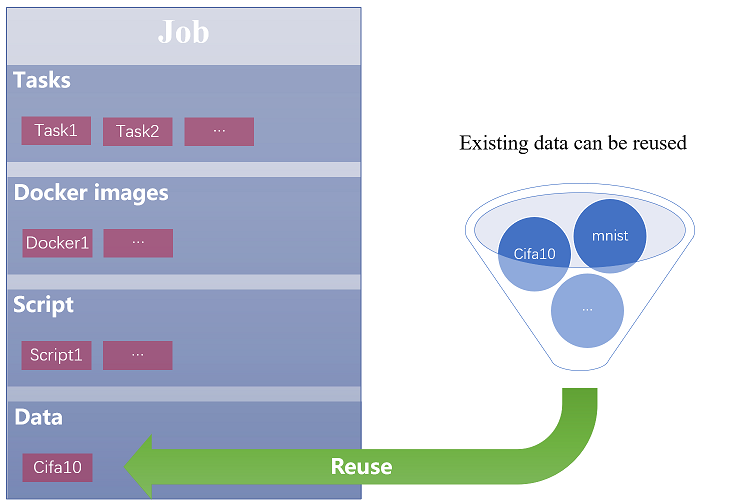
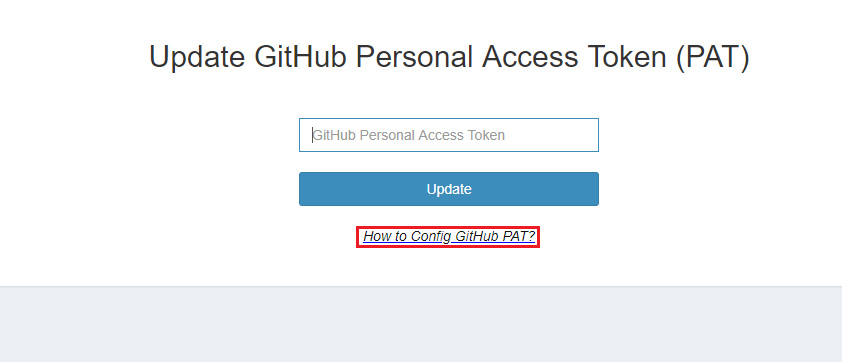
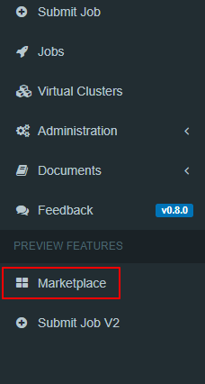
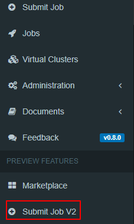
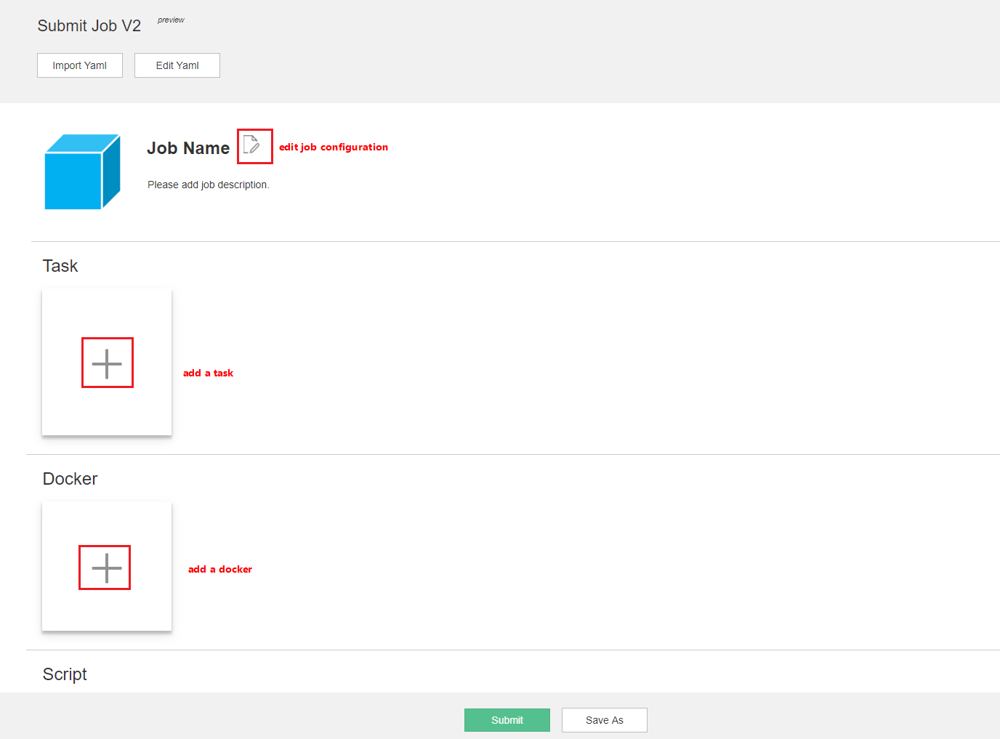
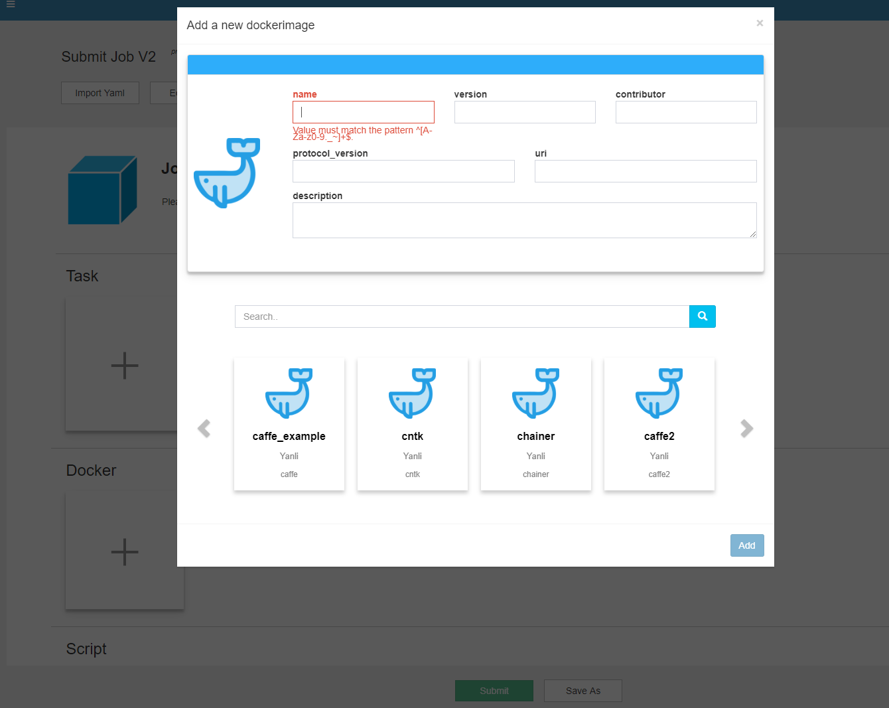
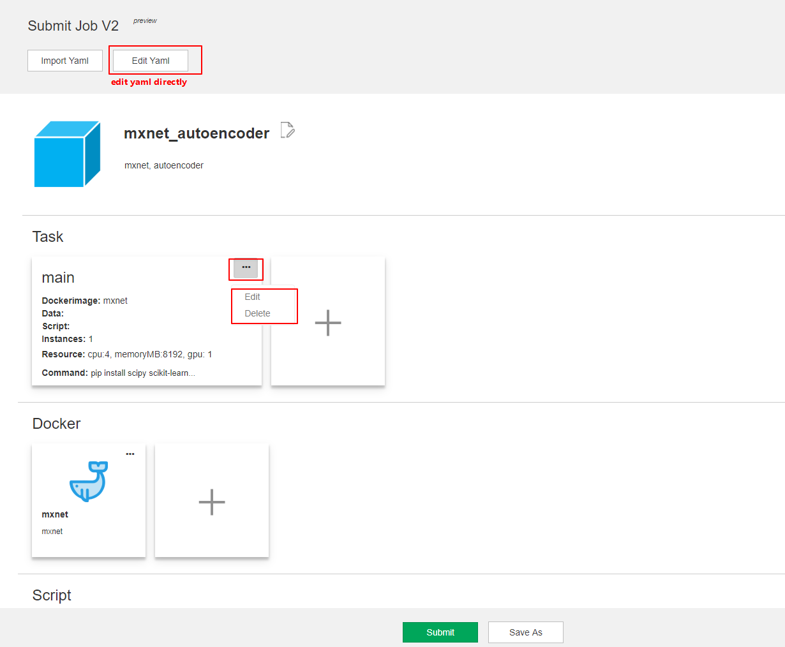

# Marketplace and Submit job v2

`Marketplace` and `Submit job v2` are designed for reproducible AI. It helps to reuse machine learning asset across projects or teams: job template sharing and reuse for docker images, data, code, job configuration and etc.


## Table of Contents

1. [Marketplace and Submit job V2 Overview](#marketplace-and-submit-job-v2-overview)
2. [When to consider marketplace and submit job v2](#when-to-consider-marketplace-and-submit-job-v2)
3. [How to use](#how-to-use)
4. [System design](#system-design)
5. [Resource](#resource)


## Marketplace and Submit job V2 Overview
In V2, job configuration is specified in a yaml file. The configuration consists of four components: tasks, docker images, script, and data.

User can compose a job configuration by creating new components or using existing ones.



User can publish some components or the entire job configurations to the marketplace for other people to reuse.


## When to consider marketplace and submit job v2

1. When you want to try different models on your collected/downloaded data.
2. When you want to use your model to train or predict on different data.
3. When you want to share your data, model, docker images, job template with others.
4. When you just want to try OpenPAI.


## How to use

### Configure GitHub PAT

1. At PAI home page, click the top right corner to **login**

2. Click your username at the top right corner, and then click "Change Github PAT"


3. Enter your github personal Access Token, and click update. If you don't know how to get it, click the "How to config Github PAT" to see details.




### Run a job from marketplace

1. At PAI home page, click the top right corner to **login** (Ignore this step if you are already logged in).
2. At the left sidebar, click "marketplace"



3. Choose a job template, for example: tensorflow_cifar10


4. In job details page, click the "use" button, then it will go to the submit page(v2 version).

   

5. Click "Submit" button at the bottom, If you successfully submitted the job, you will see a success message.


### Introduction to the yaml file for job configuration

In submit job v2,  we use **yaml** to describe the job configuration. The detailed format is shown as below :

> `job`

```yaml
protocol_version: String
name: String
type: job
version: String
contributor: String
description: String
retryCount: Integer
virtualCluster: String

parameters:
  userParam1: valType1
  userParam2: valType2
  ...

tasks:
  - task
  - task
  ...

prerequisites: 
  - dockerimage
  - script
  - data
  - output
  ...
```

> `data`

Data is one of the element type in prerequisites section. It is an independent component that can be shared with other jobs. It contains all the data urls and preprocess commands that will be used in one task. Its local directory in the docker is specified by `name` (`name`/`uri`). 
```yaml
protocol_version: String
name: String
type: data
version: String
contributor: String
description: String
uri:
  - String
  - String
  ...
command:
  - String
  - String
  ...
```

> `script`

Script is one of the element type in prerequisites section. It is an independent component that can be shared with other jobs. It contains all the script repos and preprocess commands that will be used in one task. Its local directory in the docker is specified by `name` (`name`/`uri`). 
```yaml
protocol_version: String
name: String
type: script
version: String
contributor: String
description: String
uri:
  - String
  - String
  ...
command:
  - String
  - String
  ...
```

> `output`

Output is one of the element type in prerequisites section. It is not an independent component which should be specified by users. It contains all the output storage resources and postprocess commands that will be used in one task. Its local directory in the docker is specified by `name` (`name`/`uri`).
```yaml
protocol_version: String
name: String
type: output
version: String
contributor: String
description: String
uri:
  - String
  - String
  ...
command:
  - String
  - String
  ...
```

> `dockerimage`

Dockerimage is one of the element type in prerequisites section. It is an independent component that can be shared with other jobs. It contains the docker image that will be used in one task.
```yaml
protocol_version: String
name: String
type: dockerimage
version: String
contributor: String
description: String
uri: String
```

> `task`

Task is not an independent component, it is the element type of the tasks. A job may consists of multiple types of tasks (at least one), denoted by the role of a task, such as **_parameter_server_**, **_training_worker_**, etc. Each task can start one or more container instances to run the user defined commands. 
```yaml
role: String
data: String
script: String
output: String
dockerimage: String
resource: 
  instances: Integer
  resourcePerInstance: 
    cpu: Integer
    memoryMB: Integer
    shmMB: Integer
    gpu: Integer
  portList:
    - label: String
      beginAt: Integer
      portNumber: Integer
    - label: String
      beginAt: Integer
      portNumber: Integer
    ...
minFailedTaskCount: Integer
minSucceededTaskCount: Integer
command: 
  - String
  - String
  ...
```

The detailed explanation for each of the parameters in each section of the config file is as follows:

> job
 
| Field Name                       | Schema                     | Description                              |
| :------------------------------- | :------------------------- | :--------------------------------------- |
| `protocol_version`               | String, optional           | Protocol version, If omitted, it will be **_v2_**|
| `name`                           | String, in `^[A-Za-z0-9\-._~]+$` format, required | Name of the job   |
| `type`                           | String, required           | Must be **_job_**                            |
| `version`                        | String, optional           | Version of the job template              |
| `contributor`                    | String, optional           | Contributor of the job template          |
| `description`                    | String, optional           | Description of the job template          |
| `virtualCluster`                 | String, optional           | The virtual cluster job runs on. If omitted, the job will run on **_default_** virtual cluster    |
| `retryCount`                     | Integer, optional          | Job retry count, no less than 0          |
| `parameters`                     | Object, optional           | Specify name and value of all the referencable parameters that will be used in the whole job template. They can be referenced by **_$$paramName$$_**.  |
| `prerequisites`                  | List, required             | List of `prerequisite`. `prerequisite` could be data, script, output, or dockerimage. Specify dockerimage at least |
| `tasks`                          | List, required             | List of `task`, one task at least |

> prerequisite

| Field Name                       | Schema                     | Description                              |
| :------------------------------- | :------------------------- | :--------------------------------------- |
| `protocol_version`               | String, optional           | Protocol version, If omitted, it will be **_v2_**|
| `name`                           | String, in `^[A-Za-z0-9\-._~]+$` format, required | Name of the prerequisite |
| `type`                           | String, required           | Type of the prerequisite, must be **_data_**, **_script_**, **_output_**, or **_dockerimage_** |
| `version`                        | String, optional           | Version of the prerequisite              |
| `contributor`                    | String, optional           | Contributor of the prerequisite          |
| `description`                    | String, optional           | Description of the prerequisite          |
| `uri`                            | List or String, required   | Reference URLs, Only in dockerimage, it is String type. It could be any type of url, such as http, hdfs, github, ... |
| `command`                        | List of String, required   | Preprocess or postprocess commands of this prerequisite. It should contain the commands to deal with uris, either copy to local, remote mount or directly process in the script.

> task

| Field Name                       | Schema                     | Description                              |
| :------------------------------- | :------------------------- | :--------------------------------------- |
| `role`                           | String in `^[A-Za-z0-9._~]+$` format, required | Name for the task, need to be unique with other roles |
| `data`                           | String, optional           | Data that will be used in the task, name reference of a prerequisite |
| `script`                         | String, optional           | Script to be executed in the task, name reference of a prerequisite |
| `output`                         | String, optional           | Output that will be used in the task, name reference of a prerequisite |
| `dockerimage`                    | String, optional           | Docker image to be used for the task, name reference of a prerequisite |
| `resource`                       | Object, required           | Resource required for the task |
| `minFailedTaskCount`             | Integer, optional          | Number of failed tasks to kill the entire job, null or no less than 1 |
| `minSucceededTaskCount`          | Integer, optional          | Number of succeeded tasks to kill the entire job, null or no less than 1 |
| `command`                        | List, required             | List of executable commands of the task, can not be empty. Commands can reference not only the parameters defined in the `job` `parameters` session but also the properties of the current task |

> resource

| Field Name                       | Schema                     | Description                              |
| :------------------------------- | :------------------------- | :--------------------------------------- |
| `instances`                      | Integer, optional          | Number of instances for the task, default is 1 |
| `resourcePerInstance`            | Object, required           | resource required to run each instance, including cpu, memoryMB, shmMB, and gpu |
| `resourcePerInstance.cpu`        | Integer, required          | CPU number for one instance in the task, no less than 1 |
| `resourcePerInstance.memoryMB`   | Integer, required          | Memory for one instance in the task, no less than 100 |
| `resourcePerInstance.shmMB`      | Integer, optional          | Shared memory for one instance in the task, no more than memory size, default is 64 |
| `resourcePerInstance.gpu`        | Integer, required          | GPU number for one instance in the task, no less than 0 | 
| `portList`                       | List, optional             | List of `portType` to use, portType object includes label, beginAt, and portNumber parameters |
| `portType.label`        | String in `^[A-Za-z0-9._~]+$` format, required | Label name for the port type |
| `portType.beginAt`      | Integer, required          | The port to begin with in the port type, 0 for random selection |
| `portType.portNumber`   | Integer, required          | Number of ports for the specific type    |

> runtime environmental variable

Each task in a job runs in one Docker container.
For a multi-task job, one task might communicate with others.
So a task need to be aware of other tasks' runtime information such as IP, port, etc.
The system exposes such runtime information as environment variables to each task's Docker container.
For mutual communication, user can write code in the container to access those runtime environment variables.
Those environment variables can also be used in the job config file.

Below we show a complete list of environment variables accessible in a Docker container:

| Environment Variable Name          | Description                              |
| :--------------------------------- | :--------------------------------------- |
| PAI_WORK_DIR                       | Working directory in Docker container    |
| PAI_DEFAULT_FS_URI                 | Default file system uri in PAI           |
| PAI_JOB_NAME                       | `job.name` in config file                 |
| PAI_JOB_VC_NAME                    | The virtual cluster in which the job is running     |
| PAI_USER_NAME                      | User who submit the job                  |
| PAI_CURRENT_TASK_ROLE_NAME         | `task.role` of current task role     |
| PAI_CURRENT_TASK_ROLE_TASK_COUNT   | `task.resource.instances` of current task role |
| PAI_CURRENT_TASK_ROLE_CPU_COUNT    | `task.resource.cpu` of current task role  |
| PAI_CURRENT_TASK_ROLE_MEM_MB       | `task.resource.memoryMB` of current task role   |
| PAI_CURRENT_TASK_ROLE_SHM_MB       | `task.resource.shmMB` of current task role      |
| PAI_CURRENT_TASK_ROLE_GPU_COUNT    | `task.resource.gpu` of current task role  |
| PAI_CURRENT_TASK_ROLE_MIN_FAILED_TASK_COUNT    | `task.minFailedTaskCount` of current task role    |
| PAI_CURRENT_TASK_ROLE_MIN_SUCCEEDED_TASK_COUNT | `task.minSucceededTaskCount` of current task role |
| PAI_CURRENT_TASK_ROLE_CURRENT_TASK_INDEX | Index of current task in current task role, starting from 0 |
| PAI_JOB_TASK_COUNT                 | Total tasks' number in config file       |
| PAI_JOB_TASK_ROLE_COUNT            | Total task roles' number in config file  |
| PAI_JOB_TASK_ROLE_LIST             | Comma separated all task role names in config file |
| PAI_CONTAINER_HOST_IP              | Allocated ip for current docker container |
| PAI_CONTAINER_HOST_PORT_LIST       | Allocated port list for current docker container, in `portLabel0:port0,port1,port2;portLabel1:port3,port4` format |
| PAI_CONTAINER_HOST\_`$type`\_PORT_LIST | Allocated port list for `portList.label == $type`, comma separated `port` string |
| PAI_TASK_ROLE\_`$name`\_HOST_LIST  | Host list for `TASK_ROLE_NAME == $name`, comma separated `ip:port` string, sorted by current task index in task role. Each task role has a host list environment variable with the corresponding task role name |

Below is an example for a distributed tensorflow image classification training job :

```yaml
protocol_version: v2
name: tensorflow_cifar10              # name of the job
type: job
version: 1.0.0
contributor: Alice                    # contributor of the job
description: image classification, cifar10 dataset, tensorflow, distributed training
retryCount: 0                         # job retry count
virtualCluster: default               # the virtual cluster job runs on

parameters:
  model: resnet20
  batchsize: 32

tasks:
  - role: worker                      # task role name
    data: cifar10                     # task input data, name reference of data in the prerequisites
    script: tensorflow_cnnbenchmarks  # script executed in task, name reference of script in the prerequisites
    output: mycifar10                 # output that will store the output model, name reference of output in the prerequisites
    dockerimage: tf_example           # docker image used in task, name reference of dockerimage in the prerequisites
    resource:                         # resource required in task 
      instances: 1                    # number of instances for the task
      resourcePerInstance: { cpu: 2, memoryMB: 16384, gpu: 4 }
    command:                          # executable commands in the task 
      - pip --quiet install scipy
      - mkdir inputdata && tar xzvf $$data$$/cifar-10-python.tar.gz -C inputdata --strip-components 1
      - export PYTHONPATH=$PAI_WORK_DIR/$$script$$/benchmarks/scripts/tf_cnn_benchmarks:$PYTHONPATH
      - python $$script$$/benchmarks/scripts/tf_cnn_benchmarks/tf_cnn_benchmarks.py --local_parameter_device=gpu --variable_update=parameter_server --ps_hosts=$PAI_TASK_ROLE_ps_server_HOST_LIST --worker_hosts=$PAI_TASK_ROLE_worker_HOST_LIST --job_name=worker --task_index=$PAI_CURRENT_TASK_ROLE_CURRENT_TASK_INDEX --data_dir=inputdata --data_name=$$data$$ --train_dir=$$output$$/cifar10_model --model=$$model$$ --batch_size=$$batchsize$$
  - role: ps_server
    data: cifar10 
    output: mycifar10
    script: tensorflow_cnnbenchmarks
    dockerimage: tf_example
    resource:
      instances: 1
      resourcePerInstance: { cpu: 2, memoryMB: 8192, gpu: 0 }
    command:
      - pip --quiet install scipy
      - mkdir inputdata && tar xzvf $$data$$/cifar-10-python.tar.gz -C inputdata --strip-components 1
      - export PYTHONPATH=$PAI_WORK_DIR/$$script$$/benchmarks/scripts/tf_cnn_benchmarks:$PYTHONPATH
      - python $$script$$/benchmarks/scripts/tf_cnn_benchmarks/tf_cnn_benchmarks.py --local_parameter_device=cpu --variable_update=parameter_server --ps_hosts=$PAI_TASK_ROLE_ps_server_HOST_LIST --worker_hosts=$PAI_TASK_ROLE_worker_HOST_LIST --job_name=ps --task_index=$PAI_CURRENT_TASK_ROLE_CURRENT_TASK_INDEX --data_dir=inputdata --data_name=$$data$$ --train_dir=$$output$$/cifar10_model --model=$$model$$ --batch_size=$$batchsize$$


prerequisites: 
  - protocol_version: v2
    name: tf_example
    type: dockerimage
    version: 1.0.0
    contributor: Alice
    description: python3.5, tensorflow
    uri: openpai/pai.example.tensorflow # url pointing to the docker image used in the job
  - protocol_version: v2
    name: cifar10
    type: data
    version: 1.0.0
    contributor: Alice
    description: cifar10 dataset, image classification
    uri: 
      - https://www.cs.toronto.edu/~kriz/cifar-10-python.tar.gz # data url
    command:
      - cd cifar10 && wget https://www.cs.toronto.edu/~kriz/cifar-10-python.tar.gz && cd .. # preprocess command
  - protocol_version: v2
    name: tensorflow_cnnbenchmarks
    type: script
    version: 1.0.0
    contributor: MaggieQi
    description: tensorflow benchmarks
    uri: 
      - https://github.com/MaggieQi/benchmarks@84820935288cab696c9c2ac409cbd46a1f24723d # script repo, after @ is the specific version 
    command:                                                                           # perprocess command
      - cd tensorflow_cnnbenchmarks
      - git clone https://github.com/MaggieQi/benchmarks
      - cd benchmarks && git checkout 84820935288cab696c9c2ac409cbd46a1f24723d && cd ..
      - cd ..
  - protocol_version: v2
    name: mycifar10
    type: output
    version: 1.0.0
    contributor: Alice
    description: cifar10 data output
    uri: 
      - hdfs://10.151.40.179:9000/core/cifar10_model      # output storage url
    command:
      - hdfs dfs -cp mycifar10 hdfs://10.151.40.179:9000/core/cifar10_model  # postprocess commands
```

For more examples, please refer to [marketplace directory](https://github.com/Microsoft/pai/tree/master/marketplace).


### Submit job V2

1. At PAI home page, click the top right corner to **login** (Ignore this step if you are already logged in).

2. At the left sidebar, click "Submit Job V2"

   

3. In submit job(v2) page, there are two ways to configure your job.

   Firstly, you can import your template from yaml file


​       Or you can add you job components by web UI:



For example, when you click the add docker image button, you can fill the table or choose a docker image which from marketplace.



4. After import or add some job components, you can edit or delete a task/docker/script/data by web UI. Furthermore, you can edit the yaml directly to change the components.

   


5. Then click "Submit" button at the bottom, if your job configuration is right you will see a success message.


## System design


The system architecture is illustrated above.


## Resource

- [Marketplace template source](https://github.com/Microsoft/pai/tree/master/marketplace)


