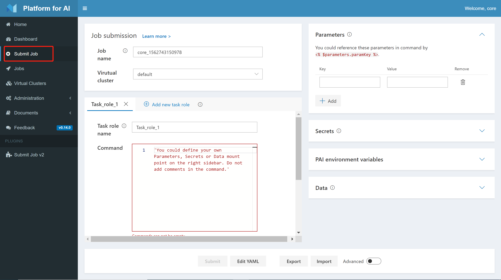
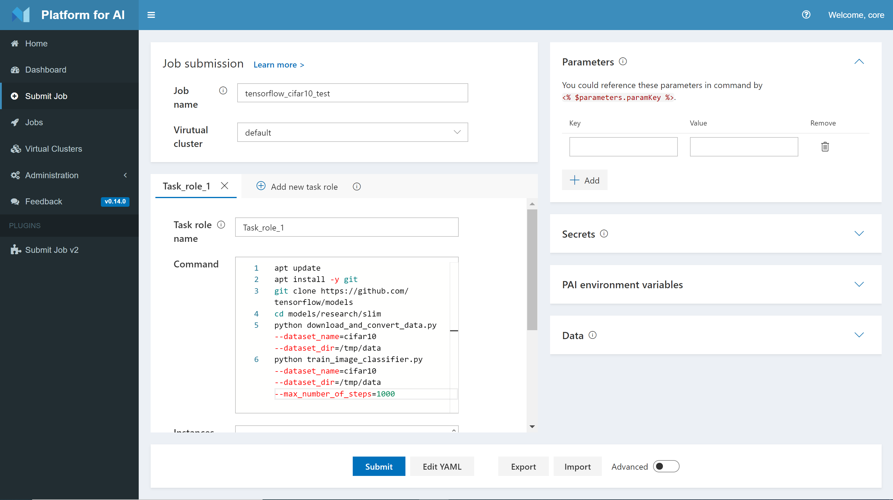
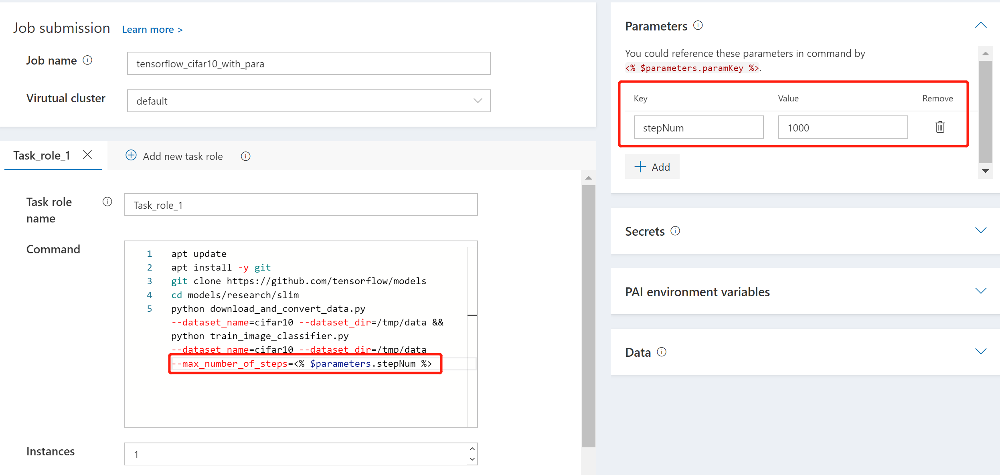

<!--
  Copyright (c) Microsoft Corporation
  All rights reserved.

  MIT License

  Permission is hereby granted, free of charge, to any person obtaining a copy of this software and associated
  documentation files (the "Software"), to deal in the Software without restriction, including without limitation
  the rights to use, copy, modify, merge, publish, distribute, sublicense, and/or sell copies of the Software, and
  to permit persons to whom the Software is furnished to do so, subject to the following conditions:
  The above copyright notice and this permission notice shall be included in all copies or substantial portions of the Software.

  THE SOFTWARE IS PROVIDED *AS IS*, WITHOUT WARRANTY OF ANY KIND, EXPRESS OR IMPLIED, INCLUDING
  BUT NOT LIMITED TO THE WARRANTIES OF MERCHANTABILITY, FITNESS FOR A PARTICULAR PURPOSE AND
  NONINFRINGEMENT. IN NO EVENT SHALL THE AUTHORS OR COPYRIGHT HOLDERS BE LIABLE FOR ANY CLAIM,
  DAMAGES OR OTHER LIABILITY, WHETHER IN AN ACTION OF CONTRACT, TORT OR OTHERWISE, ARISING FROM,
  OUT OF OR IN CONNECTION WITH THE SOFTWARE OR THE USE OR OTHER DEALINGS IN THE SOFTWARE.
-->

# Submit Jobs on OpenPAI

This document is a tutorial for job submission on OpenPAI. Before learning this document, make sure you have an OpenPAI cluster already. If there isn't yet, refer to [here](../../README.md#deploy-openpai) to deploy one.

There are several ways of submitting pai job, including webportal, [OpenPAI VS Code Client](../../contrib/pai_vscode/VSCodeExt.md), and [python sdk]. Here we use webportal to submit a hello world job.

## Submit a Hello World Job

The **job** of OpenPAI defines how to execute code(s) and command(s) in specified environment(s). A job can be run on single node or distributed.

The following process submits a model training job implemented by TensorFlow on CIFAR-10 dataset. It downloads data and code from internet and helps getting started with OpenPAI. [Next Section](#Learn-the-Hello-World-Job) include more details about this job config.

1. Login to OpenPAI web portal.

2. Click **Submit Job** on the left pane and reach this page.

   

3. Fill in the name of your virtual cluster, and give a name of your job and your task role. Then copy the following commands into the command box.

   ```bash
   apt update
   apt install -y git
   git clone https://github.com/tensorflow/models
   cd models/research/slim
   python download_and_convert_data.py --dataset_name=cifar10 --dataset_dir=/tmp/data
   python train_image_classifier.py --dataset_name=cifar10 --dataset_dir=/tmp/data --max_number_of_steps=1000
   ```

   Note: Please **Do Not** use # for comments or use \ for line continuation in the command box. These symbols may break the syntax and will be supported in the future.

   

4. Specify the resources you need. By default only gpu number could be set. Toggle the "custom" button if you need to customize CPU number and memory. Here we use the default setting which utilizes one GPU.

5. Specify the docker image. You can either use the listed docker images or take advantage of your own one. Here we use "ufoym/deepo:tensorflow-py36-cu90" as the docker image. OpenPAI will pull images from the [official Docker Hub](https://hub.docker.com/). If you want to use your own Docker registry, please click the "Auth" button and fill in the required information.

   

6. Click **Submit** to kick off your first OpenPAI job!

## Learn the Hello World Job

The Hello World job is set to download the CIFAR-10 dataset and train a simple model with 1,000 steps. Here are some detailed explanations about configs on the submission page:

- **Job name** is the name of current job. It must be unique in each user account. A meaningful name helps manage jobs well.

- **Task role name** defines names of different roles in a job.

  For single server jobs, there is only one role in taskRoles.

  For distributed jobs, there may be multiple roles in taskRoles. For example, when TensorFlow is used to running distributed job, it has two roles, including parameter server and worker. There are two task roles in the corresponding job configuration. The names of task roles can be used in environment variables in distributed jobs.

- **Instances** is the number of instances of this task role. In single server jobs, it should be 1. In distributed jobs, it depends on how many instances are needed for a task role. For example, if it's 8 in a worker role of TensorFlow. It means there should be 8 Docker containers for the worker role.

- **GPU count**, **CPU vcore count**, **Memory (MB)** are easy to understand. They specify corresponding hardware resources including the number of GPUs, MB of memory, and the number of CPU cores.

- **Command** is the commands to run in this task role. It can be multiple lines. For example, in the hello-world job, the command clones code from GitHub, downloads data and then executes the training progress. If one command fails (exits with a nonzero code), the following commands will not be executed. This behavior may be changed in the future.

- **Docker image**

  OpenPAI uses [Docker](https://www.docker.com/why-docker) to provide consistent and independent environments. With Docker, OpenPAI can serve multiple job requests on the same server. The job environment depends significantly on the docker image you select.

  The hub.docker.com is a public Docker repository. And the [ufoym/deepo](https://hub.docker.com/r/ufoym/deepo) on hub.docker.com is recommended for deep learning. In the hello-world example, it uses a TensorFlow image, *ufoym/deepo:tensorflow-py36-cu90*, in ufoym/deepo. You can also set your own image from private repository by toggling custom button.

  If an appropriate Docker image isn't found, you could [build a Docker image](../job_docker_env.md) by your self.

  Note, if a Docker image doesn't include *openssh-server* and *curl* packages, it cannot use SSH feature of OpenPAI. If SSH is needed, a new Docker image can be built and includes *openssh-server* and *curl* on top of the existing Docker image.

## Manage Your Data

Most model training and other kinds of jobs need to transfer files between running environments and outside. Files include dataset, code, scripts, trained model, and so on.

### Make Use of Team-wise Storage

OpenPAI admin can define Team-wise Storage through [Team-wise Storage Plugin](../../contrib/storage_plugin/README.MD). It can support multiple NAS file systems like NFS, Samba, HDFS, Azurefile and Azureblob.

Once your OpenPAI admin has set up Team-wise storage for your group, you can find your Team-wise storage settings in Data section. Check team-wise configs to mount NAS as local path in job container.


Note: Using Team-wise storage will inject code to commands with comments. Please do not modify the auto-generated codes.

### Additional Data Sources

Besides Team Storage, OpenPAI also supports local files, http/https files, git repository, and PAI HDFS as additional data sources. Click the button **Add data source** to choose one kind of data source and fill in the path information in the text box. For example, the following setting will copy the HDFS folder "/foo/bar" to "/pai_data/mydata". You can access the folder with "/pai_data/mydata/bar" in your commands.


## Use Parameters and Secrets

It is common to train models with different parameters. OpenPAI supports parameter definition and reference, which provides a flexible way of training and comparing models. You can define your parameters in the **Parameters** section and reference them by using <% $parameters.paramKey %> in your commands. For example, the following picture shows how to define the Hello World job using a "stepNum" parameter.



You can define batch size, learning rate, or whatever you want as parameters to accelerate your job submission.

In some cases, it is desired to define some secret messages such as password, token, etc. You can use the **Secrets** section for the information. The usage is the same as parameters except that secrets will not be displayed or recorded.

## Advanced Mode

You can set more detailed configs by enabling advanced mode. In the advanced mode, you could define ```retry time```, ```ports```, ```completion policy``` before submitting job. For more details about the fields, please refer to [Pai Job Protocol](../pai-job-protocol.yaml)

## PAI Environment Variables

Each task in a job runs in one Docker container.
For a multi-task job, one task might communicate with others.
So a task need to be aware of other tasks' runtime information such as IP, port, etc.
The system exposes such runtime information as environment variables to each task's Docker container.
For mutual communication, user can write code in the container to access those runtime environment variables.
Those environment variables can also be used in the job config file.

Below we show a complete list of environment variables accessible in a Docker container:

| Category          | Environment Variable Name                             | Description                                                                        |
| :---------------- | :---------------------------------------------------- | :--------------------------------------------------------------------------------- |
| Job level         | PAI_JOB_NAME                                          | `jobName` in config file                                                           |
|                   | PAI_USER_NAME                                         | User who submit the job                                                            |
|                   | PAI_DEFAULT_FS_URI                                    | Default file system uri in PAI                                                     |
| Task role level   | PAI_TASK_ROLE_COUNT                                   | Total task roles' number in config file                                            |
|                   | PAI_TASK_ROLE_LIST                                    | Comma separated all task role names in config file                                 |
|                   | PAI_TASK_ROLE_TASK_COUNT\_`$taskRole`                 | Task count of the task role                                                        |
|                   | PAI_HOST_IP\_`$taskRole`\_`$taskIndex`                | The host IP for `taskIndex` task in `taskRole`                                     |
|                   | PAI_PORT_LIST\_`$taskRole`\_`$taskIndex`\_`$portType` | The `$portType` port list for `taskIndex` task in `taskRole`                       |
|                   | PAI_RESOURCE\_`$taskRole`                             | Resource requirement for the task role in "gpuNumber,cpuNumber,memMB,shmMB" format |
|                   | PAI_MIN_FAILED_TASK_COUNT\_`$taskRole`                | `taskRole.minFailedTaskCount` of the task role                                     |
|                   | PAI_MIN_SUCCEEDED_TASK_COUNT\_`$taskRole`             | `taskRole.minSucceededTaskCount` of the task role                                  |
| Current task role | PAI_CURRENT_TASK_ROLE_NAME                            | `taskRole.name` of current task role                                               |
| Current task      | PAI_CURRENT_TASK_ROLE_CURRENT_TASK_INDEX              | Index of current task in current task role, starting from 0                        |

## Export and Import Jobs

In OpenPAI, all jobs are represented by [YAML](https://yaml.org/), a markup language. You can click the button **Edit YAML** below to edit the YAML definition directly. You can also export and import YAML files using the **Export** and **Import** button.

## Job workflow

Once job configuration is ready, next step is to submit it to OpenPAI. Besides webportal, it's also recommended to use [Visual Studio Code Client](../../contrib/pai_vscode/VSCodeExt.md) or [python sdk] to submit jobs.

After receiving job configuration, OpenPAI processes it as below steps:

1. Wait for resource allocated. OpenPAI waits enough resources including CPU, memory, and GPU are allocated. If there is enough resource, the job starts very soon. If there is not enough resource, job is queued and wait on previous jobs completing and releasing resource.

2. Initialize Docker container. OpenPAI pulls the Docker image, which is specified in configuration, if the image doesn't exist locally. After that OpenPAI will initialize the Docker container.

3. run the command in configuration. During the command is executing, OpenPAI outputs [stdout and stderr](troubleshooting_job.md) near real-time. Some metrices can be used to [monitor workload](troubleshooting_job.md#how-to-check-job-log).

4. Finish job. Once the command is completed, OpenPAI use latest exit code as signal to decide the job is success or not. 0 means success, others mean failure. Then OpenPAI recycles resources for next jobs.

When a job is submitted to OpenPAI, the job's status changes from waiting, to running, then succeeded or failed. The status may display as stopped if the job is interrupted by user or system.

## Reference

- [Troubleshooting job failure](troubleshooting_job.md)
