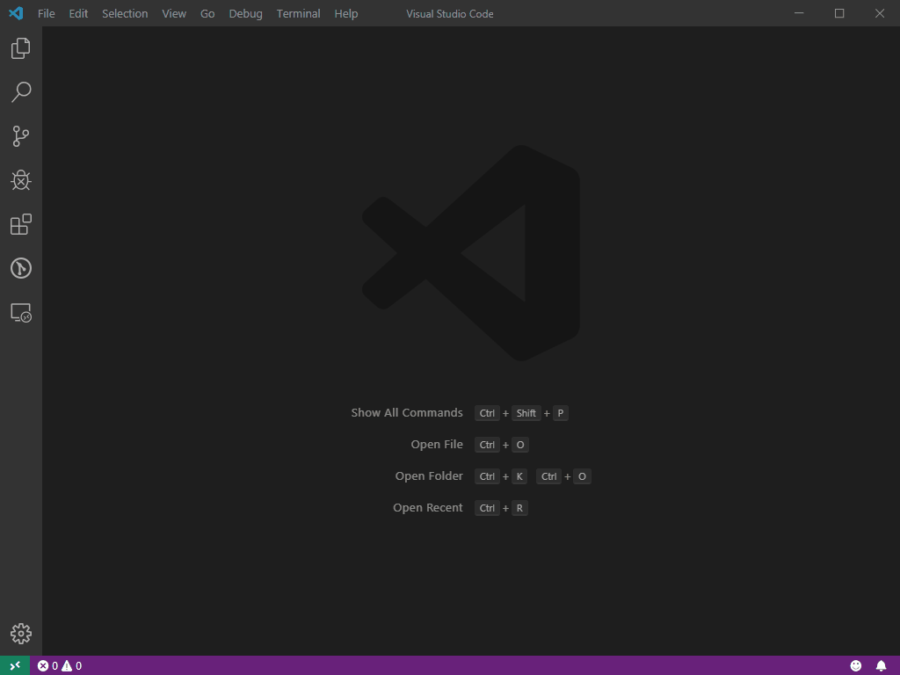

# Remote Development and Debugging

- [Remote Development and Debugging](#Remote-Development-and-Debugging)
  - [Overview](#Overview)
  - [Submit jobs](#Submit-jobs)
  - [Get SSH info](#Get-SSH-info)
  - [Configure local editors or IDEs](#Configure-local-editors-or-IDEs)
    - [CLI](#CLI)
    - [Visual Studio Code](#Visual-Studio-Code)
    - [PyCharm Professional](#PyCharm-Professional)
  - [Others](#Useful-Tools)

## Overview

**Remote development and debugging** allow users to develop and debug locally with PAI's resources.

The main processes include:
- Submit jobs
- Get SSH info
- Configure local editors or IDEs

## Submit jobs

This part has been described in [submit-a-hello-world-job](https://github.com/microsoft/pai/blob/master/docs/user/job_submission.md#submit-a-hello-world-job).

## Get SSH info

After your job started, you can get SSH info from WebPortal.

You can get **SSH ip, port and key** from the above page.

Tips: If you are using windows, you can just copy the url after `wget` and paste it in your web browser, then you will download the SSH key.

## Configure local editors or IDEs

PAI supported the following IDEs or editors:
- CLI
- Visual Studio Code
- PyCharm Professional

## CLI

For CLI usage, just SSH into your container and users can do anything they want.

## Visual Studio Code

For VS Code usage, users can install a plugin named `Remote Development` and configure it according to the following animation.

For more details, please refer to [VS code Remote Development](https://www.jetbrains.com/help/pycharm/remote-debugging-with-product.html).

## PyCharm Professional

This can only work in PyCharm Professional, users can configure PyCharm `Deployment` and `Project Interpreter` according to the following animation.

For more details, please refer to [PyCharm Remote Development](https://www.jetbrains.com/help/pycharm/remote-debugging-with-product.html).

## Others

### PAIPDB

This tool contains two debug modes:
- Start remote debugging when job task starts -
- Inject the breakpoint in source code and start debugging when hit the breakpoint.

For more details, please refer to [PAIPDB](https://github.com/microsoft/pai/blob/master/contrib/debug-tools/docs/remote-debug-pai-job.md).

### Remote-dev-tool

For users who want to share a local folder and mount it in PAI's container, we prepared a tool named remote-dev-tool which supports Ubuntu and Windows.

For more details, please refer to [remote-dev-tool](https://github.com/microsoft/pai/tree/master/contrib/remote-dev-tool).
