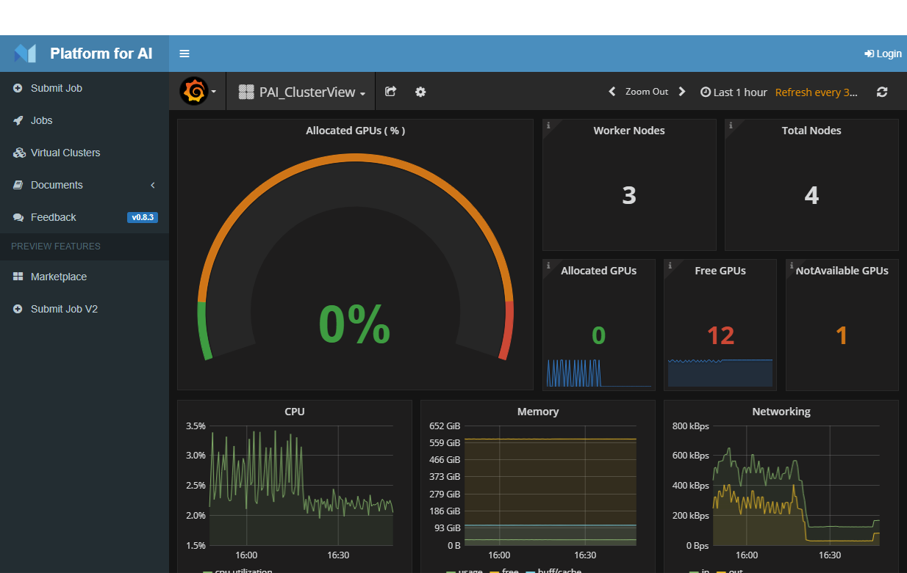
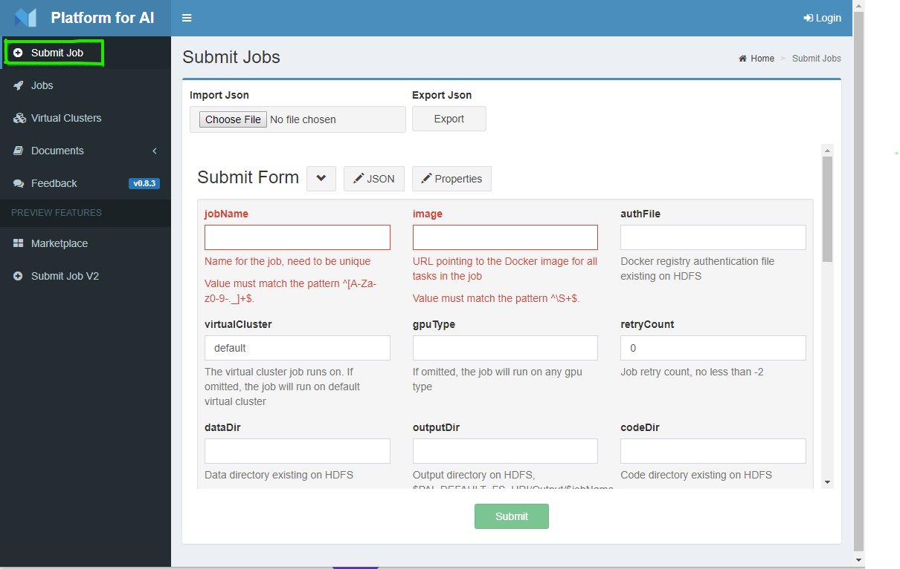
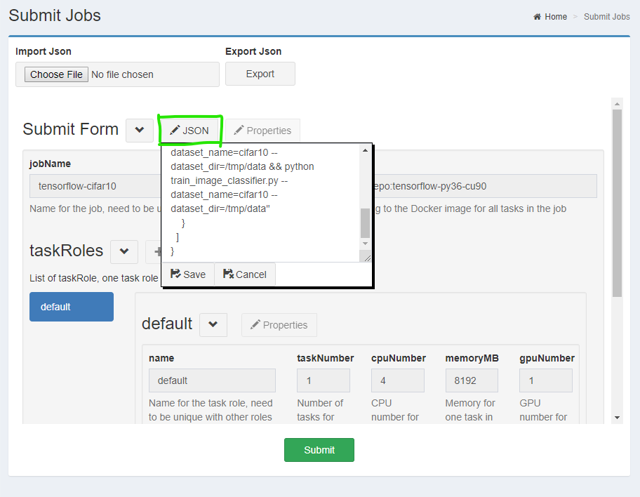
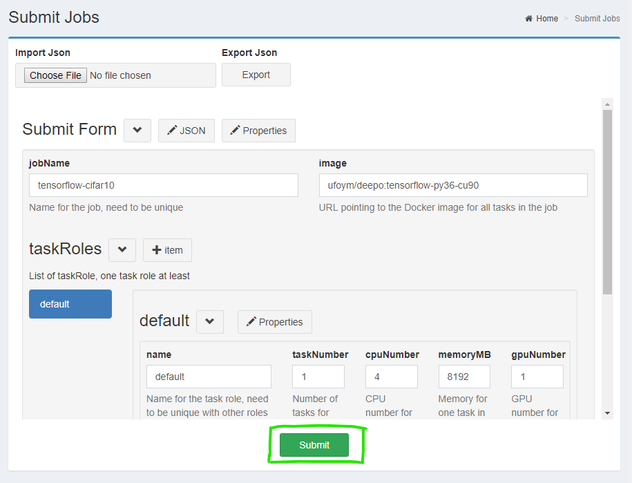

<!--
  Copyright (c) Microsoft Corporation
  All rights reserved.

  MIT License

  Permission is hereby granted, free of charge, to any person obtaining a copy of this software and associated
  documentation files (the "Software"), to deal in the Software without restriction, including without limitation
  the rights to use, copy, modify, merge, publish, distribute, sublicense, and/or sell copies of the Software, and
  to permit persons to whom the Software is furnished to do so, subject to the following conditions:
  The above copyright notice and this permission notice shall be included in all copies or substantial portions of the Software.

  THE SOFTWARE IS PROVIDED *AS IS*, WITHOUT WARRANTY OF ANY KIND, EXPRESS OR IMPLIED, INCLUDING
  BUT NOT LIMITED TO THE WARRANTIES OF MERCHANTABILITY, FITNESS FOR A PARTICULAR PURPOSE AND
  NONINFRINGEMENT. IN NO EVENT SHALL THE AUTHORS OR COPYRIGHT HOLDERS BE LIABLE FOR ANY CLAIM,
  DAMAGES OR OTHER LIABILITY, WHETHER IN AN ACTION OF CONTRACT, TORT OR OTHERWISE, ARISING FROM,
  OUT OF OR IN CONNECTION WITH THE SOFTWARE OR THE USE OR OTHER DEALINGS IN THE SOFTWARE.
-->

# Train models on OpenPAI

- [Train models on OpenPAI](#train-models-on-openpai)
  - [Submit a "hello world" job](#submit-a-%22hello-world%22-job)
  - [Understand OpenPAI job](#understand-openpai-job)
    - [Prepare job configuration](#prepare-job-configuration)
    - [Flow of a job](#flow-of-a-job)
    - [Explain "hello world" job configuration](#explain-%22hello-world%22-job-configuration)
  - [Reference](#reference)

This document is the beginning for people, who use OpenPAI to train machine learning models.

It assumes that you know address of OpenPAI and have an account to login. If there isn't an OpenPAI cluster yet, refer to [here](../../README.md#deploy-openpai) to deploy one.

## Submit a "hello world" job

The **job** of OpenPAI defines how to execute command(s) in specified environment(s). A job can execute model training , or any other kinds of commands, even it's a distributed work executed on multiple servers.

Following this section to submit a very simple job like "hello world" when learning a program language. It trains a model on CIFAR-10 dataset, and is implemented by TensorFlow. It's a very simple job, as it downloads data and code from internet, and doesn't copy model back. It helps beginners of OpenPAI to get started. After this section, there are more details to help learning how to submit real jobs.

1. Navigate to OpenPAI web portal. It needs to get IP address or domain name of OpenPAI from administrator, and an account to login.

    

2. Click **Submit Job** on the left pane and navigate to the page of submit Jobs.

    

3. Click **JSON** button. Clear existing content and paste below content in the popped text box, then click save.

    ```json
    {
    "jobName": "tensorflow-cifar10",
    "image": "ufoym/deepo:tensorflow-py36-cu90",
    "taskRoles": [
        {
        "name": "default",
        "taskNumber": 1,
        "cpuNumber": 4,
        "memoryMB": 8192,
        "gpuNumber": 1,
        "command": "git clone https://github.com/tensorflow/models && cd models/research/slim && python download_and_convert_data.py --dataset_name=cifar10 --dataset_dir=/tmp/data && python train_image_classifier.py --dataset_name=cifar10 --dataset_dir=/tmp/data"
        }
    ]
    }
    ```

    

4. It will show as below. Click **Submit** button to submit the job to OpenPAI platform.

    

    **Note**, Web portal is a default way to submit a job. To use web portal is not most efficient way, but it's simplest way to start, and OpenPAI supports many other ways.  [The client tool of OpenPAI](../../contrib/pai_vscode/VSCodeExt.md) is recommended to manage jobs of OpenPAI.

5. After submitted, it redirects to job list page, and the submitted job is in list, and shows **waiting**. Another way goes to job list, is to click **Jobs** on right pane.

    

6. Click job name can navigate to job details page. Once job is running, there are more details and actions, like status, tracking log and so on.

    

## Understand OpenPAI job

The previous section demonstrates how to submit a "hello world" job. But it's not enough to write your own job. This section introduces most knowledge about the job and provides links for further information.

### Prepare job configuration

- Choose training environment. OpenPAI uses [docker](https://www.docker.com/why-docker) to provide runtime environment. Docker is a popular technology to provide isolated environments on the same server. So that OpenPAI can serve multiple resource requests on one server.

    Refer to [here](https://hub.docker.com/r/ufoym/deepo) to find more deep learning environments, for example, `ufoym/deepo:pytorch-py36-cu90`.

    Note, this docker doesn't include openssh-server, curl. So, if SSH is necessary with those docker images, it needs to add `apt install openssh-server curl` in command field.

- Put code and data in. OpenPAI creates a clean environment with docker technology. The data and code may not be in the docker image. So it needs to use command field to copy data and code into docker before training. The command field supports to join multiple commands with `&&`. If extra system or Python components are needed, they can be installed in the command by `apt install` or `python -m pip install` as well.

    There are some suggested approach to exchange data with running environment, but it's better to check with administrators of OpenPAI, which kind of storage is supported, and recommended approach to access it.

- Copy model back. It's similar with above topic, if code and data can copy into docker, model can also be copied back.

### Flow of a job

Once job configuration is prepared, it's ready to be submitted to OpenPAI. OpenPAI process jobs as below steps.

1. Receive submitted job configuration. To submit a job, the recommended way is to use [Visual Studio Code extension for OpenPAI](../../contrib/pai_vscode/VSCodeExt.md). Both web UI and extension through [RESTful API of OpenPAI](../rest-server/API.md) to manage jobs. So, it's possible to implement your own script or tool.

1. Wait to allocate resource. As job configuration, OpenPAI waits enough resources including CPU, memory, and GPU are allocated. If there is enough resource, the job starts to run very soon. If there is not enough resource, job is queued and wait previous job to complete.

    Note, in distributed jobs, jobs start to run when first environment is ready. But user code can still wait until enough container(s) are ready.

1. Initialize enviroment. As job defined docker image, OpenPAI pulls the image, if it doesn't exist locally. After docker container is running, user's command(s) starts to run, after OpenPAI initialized in the container.

1. Complete job running. Once user's command is completed. OpenPAI use latest exit code as signal to decide the job is success or not. 0 means success, others mean failure. Then OpenPAI recycles resource for next job.

Once job is submitted to OpenPAI, user can see job's status is switching from waiting, running to succeeded or failed. It may show stopped if the job is interrupted by user or system reason.

### Explain "hello world" job configuration

The **job configuration** is a json file, which is posted to OpenPAI. Here uses the "hello world" job configuration as an example to explain key fields.

The job configuration of OpenPAI has two levels. The top level describes shared information of the job, including job name, docker image, and so on. The second level is taskRoles, it's an array. Each item in the array specifies commands and a corresponding configuration of running enviroment.

Below is part of fields in the job configuration. Refer to [here](../job_tutorial.md) for full list and more details.

- **jobName**. It's the unique name of current job, displays in web also. A meaningful name helps user managing jobs well.

- **image**. It's name of docker image, which includes specified system and Python packages, and provides a clean and consistent environment for each running.

    Administrator may provide a docker repository for the OpenPAI cluster. The hub.docker.com is a public docker repository with a lot of docker images and the [ufoym/deepo](https://hub.docker.com/r/ufoym/deepo) is recommended for deep learning docker images. In "hello world" example, it uses a TensorFlow image, *ufoym/deepo:tensorflow-py36-cu90*, from ufoym/deepo.

    If an appropriate docker image isn't found, it's not hard to [build a docker image](../job_docker_env.md) from scratch.

- **taskRoles**. The taskRoles describes different roles in a job. For simple single machine job, there is only one item in taskRoles. For distributed job, there may be multiple roles in taskRoles. For example, when TensorFlow is used to running distributed job, it uses two roles, parameter server and worker. Each role is defined with an item in taskRoles.

- **taskRoles/name**. It's name of current item and it's used in variables for corresponding nodes. A meaningful name helps to use related variables.

- **taskRoles/taskNumber**. It's number of current task instance. For a single server job, it should be 1. For distributed jobs, it depends on how many instance is needed for this task role. For example, if it's in a worker role of TensorFlow, and it's 8. It means there should be 8 workers with same configuration should be assigned to this task.

- **taskRoles/cpuNumber**, taskRoles/memoryMB, taskRoles/gpuNumber. Their name is easy to understand. They specify corresponding hardware resources including count of CPU core, MB of memory, and count of GPU.

- **taskRoles/command**. This is the command to run in the enviroment. It can be multiple commands, which are joint by && or ; like in bash. In the "hello world" job configuration, it clones code from GitHub, downloads data and starts the training progress in one line.

    As the "hello world" job, user needs to construct such command(s) to get code, data and trigger executing. It can be multiple commands, or composite into one script.

## Reference

- [Job configuration](../job_tutorial.md)
- [Examples](../../examples)
