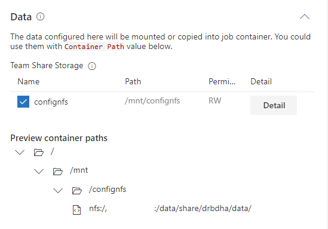

# How to Manage Data

1. [Quick Start](./quick-start.md)
2. [Work with Docker Images](./work-with-docker-images.md)
3. [How to Manage Data](./how-to-manage-data.md) (this document)
4. [How to Debug Jobs](./how-to-debug-jobs.md)
5. [Advanced Jobs](./advanced-jobs.md)
6. [Use Marketplace](./use-marketplace.md)
7. [Use VSCode Extension](./use-vscode-extension.md)
8. [Use Jupyter Notebook Extension](./use-jupyter-notebook-extension.md)

## Team-wise storage

### 1. Get permitted storage

User can get the permitted storage name in the user profile page. If you don't find any storage in the profile page, please contact the admin.


### 2. Use storage in the job

#### 2.1 Use job configuration file

To use one or more storage in job, user could specify storage names in `extras.storages` section in job configuration file:

```yaml
extras:
    storages:
    - name: confignfs
        mountPath: /data
    - name: azure-file-storage
```

Their are two fields for each storage, `name` and `mountPath`. `name` refers to storage name while `mountPath` is the mount path inside job container, which has default value `/mnt/${name}` and is optional.

```yaml
extras:
    storages: []
```

Setting it to an empty list will mount default storage for current user in the job.

#### 2.2 Use job submission page

User can also use job submission page to select desired storage:



***NOTICE: The generated protocol is different with above method. They are equivalent***

### 3. Upload data

Currently, we support `NFS`, `AzureBlob`, `AzureFile`.

#### 3.1 Upload data to NFS

##### Upload data to NFS server in Ubuntu (16.04 or above)

For Ubuntu user. To upload your data to `NFS`, please run following commands first to install nfs dependencies.
```bash
sudo apt-get update
sudo apt-get install --assume-yes nfs-common
```


Then you can run following commands to mount nfs into your machine
```bash
sudo mkdir -p MOUNT_PATH
sudo mount -t nfs4 NFS_SERVER:/NFS_PATH MOUNT_PATH
```

Copy your data to the mount point will upload your data to `NFS`

To get the `NFS_SERVER` and `NFS_PATH`, please read [Get permitted storage](#get-permitted-storage)

##### Upload data to NFS server in Windows

If admin setup `NFS` by `storage-manager`. User could access `NFS` by `Windows File Explore` directly.
For `AAD` user. Just change the file location to: `\\NFS_SERVER_ADDRESS` in `File Explore`. 

For `Basic Authentication` user or using `NFS` not through `storage-manager`. Please try to mount NFS into the Windows or using Linux vm to upload data.

#### 3.2 Upload data to Azure Blob or Azure File

For Azure Blob, user can get the `storage account name` and `container name` in the profile page.
For Azure File, user can get the `storage account name` and `file share name` in the profile page.

To upload data to Azure Blob or Azure File, please:

1. Download [Azure Storage Explore](https://azure.microsoft.com/en-us/features/storage-explorer/)
2. If you use AAD to login PAI portal, admin should already grant you the permission to access storage. User can get the `storage account name`, `container name` and `file share name` in the profile page. And please use these info to access storage in `Storage Explore`. For more details, please refer to [storage explore: add resource via azure ad](https://docs.microsoft.com/en-us/azure/vs-azure-tools-storage-manage-with-storage-explorer?tabs=windows#add-a-resource-via-azure-ad)
3. If you use basic authenticate to login PAI portal. Please ask admin for the storage `access key`. Then you can add the storage by `access key` and `storage account name`. For more details, please refer to: [storage explore: use name and key](https://docs.microsoft.com/en-us/azure/vs-azure-tools-storage-manage-with-storage-explorer?tabs=windows#use-a-name-and-key)